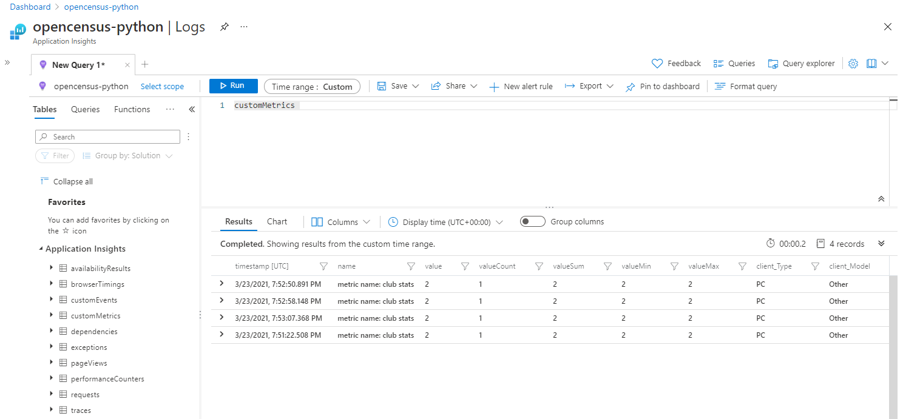

# Using OpenCensus with Python FAST API and Azure Monitor

Azure Monitor supports distributed tracing, metric collection, and logging of Python applications through integration with [OpenCensus](https://docs.microsoft.com/en-US/azure/azure-monitor/app/opencensus-python).

This sample application walks you through the process of setting up OpenCensus for Python [FAST API](https://fastapi.tiangolo.com/tutorial) and sending [monitoring data](https://docs.microsoft.com/en-us/azure/azure-monitor/app/opencensus-python#telemetry-type-mappings) to Azure Monitor for logging and tracing.

### Tracing

* Hitting an endpoint in the FastAPI application will be treated as an incoming requests (`requests` table in Azure Monitor).

### Logging

* A log message is also sent every time a function is called (`traces` table in Azure Monitor).
* An exception telemetry is sent when an invalid task is entered (established date equals to 0).

### Metrics (partially supported via OpenCensus.stats)

* Custom metrics are implemented on a specific function in the sample (customMetrics table in Azure Monitor).

**NOTE:**
`OpenCensus.stats` supports 4 aggregation methods but provides partial support for Azure Monitor. `Distribution` aggregation for example, is NOT supported by the Azure Exporter.

**NOTE:** log_level sets the threshold for logger to ["selected level"](https://docs.python.org/3/library/logging.html#logging.Logger.setLevel), In this sample [logger level](https://docs.python.org/3/library/logging.html#logging.Logger.setLevel) is set to `info`. So all traces will reflecting into Azure Monitor.

```python
if __name__=="__main__":
    print("main started")
    uvicorn.run("main:app", port=8000, log_level="info")
```

You can reach out to all options of `uvicorn` in [Uvicorn deployment documentation](https://www.uvicorn.org/deployment/#running-from-the-command-line)

## Pre-requisites

* Python 3.x
* Microsoft Azure Account

## 1. Running Clubs API project

1. Create a virtual environment.  

```bash
python -m venv .venv
```

2. Activate the virtual environment you just created.

```bash
source .venv/bin/activate
```

3. Rename the `.env.sample.txt` file to `.env`  
This contains the environment variables that you need to set for your Azure Storage account.

4. Set Application Insights Instrumentation Key variables in the `.env` file:  
`APPINSIGHTS_INSTRUMENTATIONKEY`

5. Install the dependencies.

```bash
pip install -r requirements.txt
```

6. Run the project!

```bash
python src/main.py
```

Visit [http://127.0.0.1:8000/docs](http://127.0.0.1:8000/docs) for Swagger UI

`main.py` Swagger UI:


1. GET /

```bash
curl -X 'GET'   'http://127.0.0.1:8000'   -H 'accept: application/json'   -H 'Content-Type: application/json'
```

result:

```bash
"Clubs API"
```

## Create Telemetry data

1. Create a new club `POST /clubs`

```bash
curl -X 'POST' \
  'http://127.0.0.1:8000/clubs' \
  -H 'accept: application/json' \
  -H 'Content-Type: application/json' \
  -d '{
  "name": "Fenerbahce",
  "country": "Turkey",
  "established": 1907
}'
```

```bash
curl -X 'POST' \
  'http://127.0.0.1:8000/clubs' \
  -H 'accept: application/json' \
  -H 'Content-Type: application/json' \
  -d '{
  "name": "Manchester United",
  "country": "United Kingdom",
  "established": 1878
}'
```

The following code in `create_club` function creates a custom property in Azure Monitor.

```python
## CustomDimentions
properties = {'custom_dimensions': club_db[-1] }
logger.warning('club record is added', extra=properties)
```

Custom dimension result will look like below:


2. Create an exception with wrong type:
POST /clubs

```bash
curl -X 'POST' \
  'http://127.0.0.1:8000/clubs' \
  -H 'accept: application/json' \
  -H 'Content-Type: application/json' \
  -d '{
  "name": "Arsenal",
  "country": "United Kingdom",
  "established": "a"
}'
```

result will be:

```bash
{"detail":[{"loc":["body","established"],"msg":"value is not a valid integer","type":"type_error.integer"}]}
```

3. Create an exception with invalid establish date:
POST /clubs

```bash
curl -X 'POST' \
  'http://127.0.0.1:8000/clubs' \
  -H 'accept: application/json' \
  -H 'Content-Type: application/json' \
  -d '{
  "name": "Arsenal",
  "country": "United Kingdom",
  "established": 0
}'
```

result will be:

```bash
"Internal Server Error"
```

4. GET /clubs

```bash
curl -X 'GET'   'http://127.0.0.1:8000/clubs'   -H 'accept: application/json'   -H 'Content-Type: application/json'
```

5. DELETE /clubs

```bash
curl -X 'DELETE' \
  'http://127.0.0.1:8000/clubs/Fenerbahce' \
  -H 'accept: application/json'
```

6. Let's create another exception with DELETE /clubs

```bash
curl -X 'DELETE' \
  'http://127.0.0.1:8000/clubs/Chelsea' \
  -H 'accept: application/json'
```

Since this record is not available we get a result like below:

```bash
"An error accured while deleting club id:[], Chelsea"
```

7. In this scenario, in addition to Logs and Traces, let's generate some custom metrics and push into Azure Monitor using OpenCensus stats. Stats are partially supported in Azure Monitor for more information visit [OpenCensus Python Metrics - Microsoft Docs](https://docs.microsoft.com/en-US/azure/azure-monitor/app/opencensus-python#metrics)

GET /log_custom_metric

```bash
curl -X 'GET'   'http://127.0.0.1:8000/log_custom_metric'   -H 'accept: application/json'   -H 'Content-Type: application/json'
```

After genering these custom metrics, we can view these in `customMetrics` in Azure Monitor.



Results will look like below on Azure Monitor:


## 3. Running Tests

`pytest tests/test.py`

```bash
$ pytest tests/test.py
=========================== test session starts =================================
platform win32 -- Python 3.8.7, pytest-6.2.2, py-1.10.0, pluggy-0.13.1
rootdir: C:\Users\username\opencensus-with-fastapi-and-azure-monitor
collected 7 items

tests\test.py ......                                                       [100%]
================================ 7 passed in 0.48s ===============================
```

## License

See [LICENSE](LICENSE).

## Code of Conduct

This project has adopted the [Microsoft Open Source Code of Conduct](https://opensource.microsoft.com/codeofconduct/). For more information see the [Code of Conduct FAQ](https://opensource.microsoft.com/codeofconduct/faq/) or contact [opencode@microsoft.com](mailto:opencode@microsoft.com) with any additional questions or comments.

## Contributing

See [CONTRIBUTING](CONTRIBUTING).
